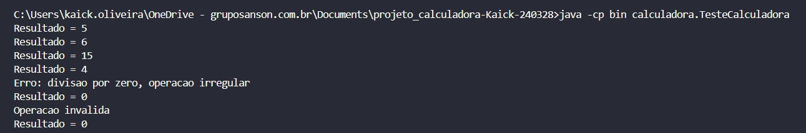
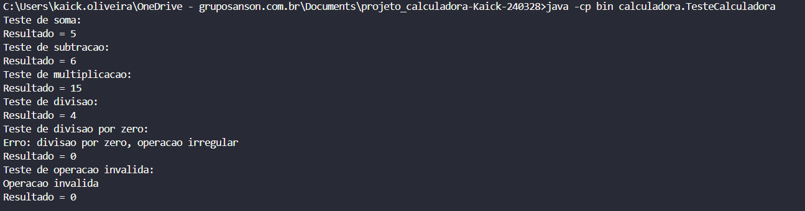
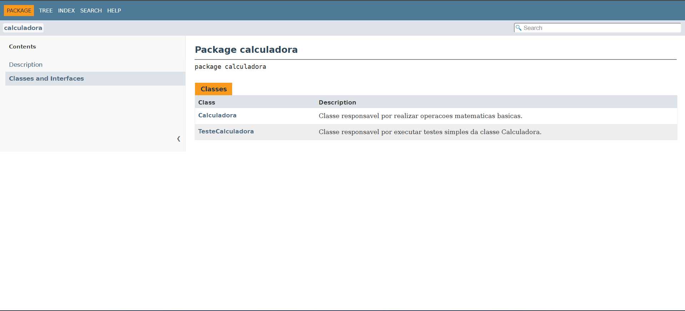

# Projeto Calculadora

Projeto desenvolvido por **Kaick Gomes de Oliveira** — **RA 240328**.

## Sobre o Projeto

Este projeto foi desenvolvido em **Java** para a atividade individual **Testes Funcionais, Refatoração e Documentação de Software**.

O sistema consiste em uma calculadora simples criada para a startup fictícia **FinançApp**. A proposta é realizar operações matemáticas básicas que podem ser utilizadas em funcionalidades de controle financeiro pessoal, como cálculo de orçamento mensal, divisão de despesas e projeção de economia.

## Objetivo da Atividade

A atividade tem como objetivo aplicar práticas de qualidade de software em um projeto Java, contemplando:

- Testes funcionais;
- Testes unitários;
- Tratamento de erros;
- Refatoração de código;
- Documentação técnica com JavaDoc;
- Versionamento com Git e GitHub.

## Tecnologias Utilizadas

- Java;
- JavaDoc;
- Git;
- GitHub;
- Visual Studio Code;
- Terminal do Windows.

## Estrutura do Projeto

```text
projeto_calculadora-Kaick-240328/
├── src/
│   └── calculadora/
│       ├── Calculadora.java
│       └── TesteCalculadora.java
├── docs/
├── imagens/
│   ├── JavaDoc.png
│   ├── teste.jpg
│   └── teste2.png
├── .gitignore
└── README.md
```

## Funcionamento da Calculadora

A classe principal do projeto é a classe `Calculadora`, localizada no pacote `calculadora`.

Ela possui o método:

```java
calc(int a, int b, String op)
```

Esse método recebe dois números inteiros e uma operação matemática, retornando o resultado do cálculo.

## Operações Disponíveis

A calculadora realiza as quatro operações matemáticas básicas:

| Operação | Símbolo | Exemplo | Resultado |
|---|---:|---:|---:|
| Soma | `+` | `2 + 3` | `5` |
| Subtração | `-` | `10 - 4` | `6` |
| Multiplicação | `*` | `3 * 5` | `15` |
| Divisão | `/` | `8 / 2` | `4` |

## Tratamento de Erros

O sistema possui tratamento para evitar falhas durante a execução.

Os seguintes casos foram tratados:

- Divisão por zero;
- Operação inválida.

Quando ocorre uma divisão por zero, o sistema exibe uma mensagem de erro e retorna `0`, evitando que o programa seja interrompido.

Quando uma operação inválida é informada, o sistema exibe a mensagem:

```text
Operacao invalida
```

Nesse caso, o método também retorna `0`.

## Testes Realizados

A classe `TesteCalculadora` foi criada para testar o funcionamento da classe `Calculadora`.

Foram testados os seguintes casos:

- Soma;
- Subtração;
- Multiplicação;
- Divisão;
- Divisão por zero;
- Operação inválida.

## Prints da Execução dos Testes

### Versão Inicial

A imagem abaixo mostra a execução inicial dos testes no terminal.



### Após Refatoração

A imagem abaixo mostra os testes executados novamente após a refatoração do código.



## Refatoração

Após a implementação inicial, foi criada a branch `Refatoracao`.

Nessa branch, o código foi reorganizado para melhorar a legibilidade e facilitar a manutenção.

As principais melhorias aplicadas foram:

- Extração de métodos;
- Separação das operações em métodos específicos;
- Melhoria na organização lógica do código;
- Simplificação da estrutura de decisão;
- Manutenção do comportamento original do sistema.

Mesmo após a refatoração, todos os testes continuaram funcionando corretamente.

## Documentação JavaDoc

A documentação técnica foi criada utilizando comentários JavaDoc no código-fonte.

Foram documentados:

- Classes;
- Métodos;
- Parâmetros;
- Retornos;
- Funcionamento geral do sistema.

A documentação HTML foi gerada na pasta:

```text
docs/
```

O arquivo principal da documentação é:

```text
docs/index.html
```

### Print da Documentação JavaDoc

A imagem abaixo mostra a documentação JavaDoc gerada e aberta no navegador.



## Como Compilar o Projeto

Para compilar o projeto, execute o comando abaixo na raiz do projeto:

```bat
javac -d bin src\calculadora\Calculadora.java src\calculadora\TesteCalculadora.java
```

## Como Executar os Testes

Após compilar o projeto, execute:

```bat
java -cp bin calculadora.TesteCalculadora
```

## Como Gerar a Documentação JavaDoc

Para gerar a documentação JavaDoc, execute:

```bat
"C:\Program Files\Java\jdk-23\bin\javadoc.exe" -d docs -sourcepath src calculadora
```

Depois, abra o arquivo:

```text
docs/index.html
```

## Versionamento

O projeto foi versionado utilizando **Git** e **GitHub**.

Foram criadas duas branches principais:

| Branch | Descrição |
|---|---|
| `main` | Versão inicial do projeto |
| `Refatoracao` | Versão refatorada, documentada e com JavaDoc gerado |

## Commits

Os commits foram organizados conforme as etapas do desenvolvimento:

- Implementação inicial da calculadora;
- Criação dos testes;
- Refatoração da classe `Calculadora`;
- Refatoração da classe `TesteCalculadora`;
- Documentação com JavaDoc;
- Geração da documentação HTML;
- Atualização do README com prints.

## Link do Repositório

Repositório no GitHub:

```text
https://github.com/kaickgomesoliveira/projeto_calculadora-Kaick-240328
```

## Autor

**Kaick Gomes de Oliveira**  
**RA:** 240328

## Professor

**Daniel Ohata**
